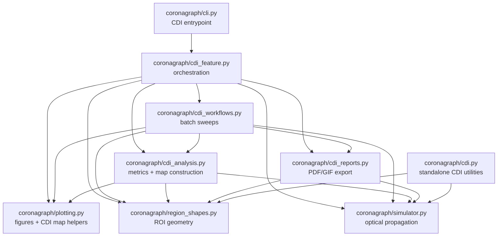

# CDI Module Dependency Tree

This is the smaller module dependency view for the CDI path only, derived from the current `coronagraph/` imports.

## Read It Top-Down

- `cli.py` enters the CDI flow through `cdi_feature.py`.
- `cdi_feature.py` is the main coordinator. It pulls together:
  - sweep execution from `cdi_workflows.py`
  - metric and incoherence-map logic from `cdi_analysis.py`
  - output generation from `cdi_reports.py`
  - plotting helpers from `plotting.py`
  - shared geometry from `region_shapes.py`
  - optical simulation from `simulator.py`
- `cdi_workflows.py` is a narrower orchestration layer for repeated sweep/report jobs.
- `cdi_analysis.py` is the analytical core for CDI scoring and map generation.
- `cdi_reports.py` stays on the export side and depends only on shared geometry/simulation primitives.
- `cdi.py` is adjacent CDI support code, but it is not part of the main `cli.py -> cdi_feature.py` execution path.

## Scope

Excluded on purpose:

- `coc_*` wrapper modules
- GUI code
- scripts under `scripts/`
- tests
- poster asset generation under `spie_poster/`
