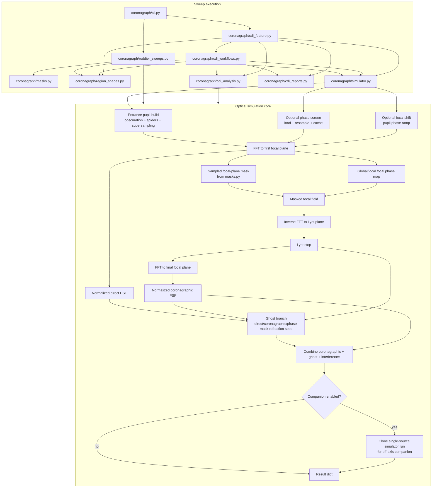

# Optical Simulation And Sweep Execution Architecture

This view focuses on two connected layers:

1. the optical propagation core in `coronagraph/simulator.py`
2. the parameter-sweep orchestration in `coronagraph/roddier_sweeps.py` and `coronagraph/cli.py`

## What Runs Where

- `cli.py` is the outer entrypoint.
- Simple sweeps such as:
  - `sweep_roddier_radius_for_peak_match`
  - `sweep_roddier_phase_for_peak_match`
  - `sweep_local_region_phase_peaks`
  live in `roddier_sweeps.py`.
- CDI-oriented multi-step sweeps live one layer higher in:
  - `cdi_feature.py`
  - `cdi_workflows.py`
  - `cdi_analysis.py`
  - `cdi_reports.py`

## Optical Simulation Pipeline

`CoronagraphSimulator.run()` is the central propagation pipeline:

- build entrance pupil
- apply optional pupil phase screen
- apply optional focal shift as a pupil phase ramp
- FFT into first focal plane
- apply focal-plane phase mask and optional local/global phase offsets
- inverse FFT into Lyot plane
- apply Lyot stop
- FFT into final focal plane
- normalize direct and coronagraphic PSFs
- build ghost contribution
- optionally add coherent interference
- optionally recurse once for the off-axis companion branch
- return a result dictionary with PSFs, fields, masks, and metadata

## Sweep Pattern

Most sweep functions follow the same pattern:

1. build a local `sim_kwargs` variant
2. vary one control parameter or geometry
3. run `CoronagraphSimulator(**local_kwargs).run()`
4. extract a metric or map
5. collect arrays over the sweep
6. optionally save plots or summary artifacts

Concrete examples:

- `sweep_roddier_radius_for_peak_match`:
  varies `RoddierPhaseMask(radius_lamD=...)`
- `sweep_roddier_phase_for_peak_match`:
  varies `RoddierPhaseMask(phase_rad=...)`
- `sweep_local_region_phase_peaks`:
  varies local or global phase injection and measures region peaks
- CDI workflow sweeps:
  vary ROI size, ring geometry, planet position, or rotation and then pass the resulting stacks through CDI analysis/report generation

## Practical Dependency Read

- If you are changing physics or propagation, start in `simulator.py`.
- If you are changing mask behavior, start in `masks.py`.
- If you are changing how a one-parameter sweep is executed, start in `roddier_sweeps.py`.
- If you are changing CDI batch experiments and generated outputs, start in `cdi_feature.py` and `cdi_workflows.py`.
